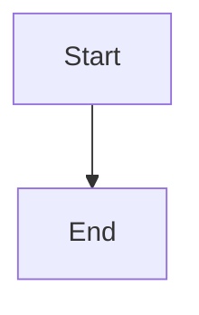

# Blogs (Markdown + Mermaid)

## Agent rule: one session, no "continue" prompts

If you are an LLM/agent working on blog tasks in this repo:
- Work end-to-end in a single session: do the full workflow and finish with a short summary.
- Do **not** ask the user to say “continue” or to choose between obvious next steps.
- Only ask a question when you are genuinely blocked (missing required info / ambiguity that changes file paths or outcomes). Otherwise, pick the simplest sensible default and proceed.
- When you hit missing tooling/deps, install what’s needed (prefer the repo `.venv`) and re-run, instead of pausing for confirmation.

## LLM quick instructions (do this for every blog)

| Step | Do                                                                                                   | Details                                                                                                                    |
| ---- | ---------------------------------------------------------------------------------------------------- | -------------------------------------------------------------------------------------------------------------------------- |
| 1    | Preview via an HTTP server (never `file://`)                                                         | See [Local preview](#local-preview-required)                                                                               |
| 2    | Use one folder per post (`Blogs/<slug>/`) with `index.html` + `post.md`                              | See [Preferred structure](#preferred-structure-one-folder-per-post)                                                        |
| 3    | Copy the canonical template; keep `index.html` minimal (no extra header/hero)                        | See [Template](#template-blogsbalancing-human-and-machine-in-development) and [Step-by-step](#step-by-step-agent-friendly) |
| 4    | Use root-relative links for shared assets/navigation (`/Blogs/...`, `/shared/...`, `/portfolio/...`) | See repo rules in [AGENTS.md](../AGENTS.md)                                                                                |
| 5    | Author/clean `post.md` (intro image, sections, code, diagrams)                                       | See [Authoring `post.md`](#authoring-postmd)                                                                               |
| 6    | If source is PDF: extract text + images, then rename/prune images                                    | See [PDF workflow](#pdf-workflow-text--images)                                                                             |
| 7    | Update the blog hub list                                                                             | See [Updating the blog hub](#updating-the-blog-hub)                                                                        |

This repo is a static website (GitHub Pages + custom domain). Blog posts can be authored in Markdown (with optional Mermaid diagrams) and rendered client-side in the browser.

The canonical template is:
- `Blogs\balancing-human-and-machine-in-development`


## Local preview (required)
Do **not** open pages via `file://` URLs: root-relative links and fetch-based Markdown includes will break.

From the repo root:
- Windows: run `start-server.bat`
- macOS/Linux: run `./start-server.sh`
- Manual: `python -m http.server 8000`

Then open:
- `http://localhost:8000/Blogs/`


## Preferred structure (one folder per post)
Create a folder per post:

```
Blogs/
  <slug>/
    index.html      # renders the Markdown
    post.md         # Markdown source
    full.html       # (optional) full HTML fallback
    images/         # (optional) local images
```

Notes:
- Every browsable folder must contain an `index.html`.
- Use **root-relative** links for shared assets and internal navigation (`/Blogs/...`, `/shared/...`, `/portfolio/...`).


## Rendering pipeline
Markdown + Mermaid rendering is done client-side via:
- `/portfolio/shared/markdown-mermaid.js`

Important:
- There is **no** `/shared/markdown-mermaid.js` at repo root.

How it works (high level):
- In HTML, add an element with `data-md-include="./post.md"`.
- The script fetches the Markdown, renders it to HTML, sanitizes it, and runs Mermaid on ` ```mermaid ` blocks.


## PDF workflow (text + images)
If a blog post is sourced from a PDF (e.g. a Medium export), use the Python helpers in:
- `Blogs/tools/`

Note:
- The canonical scripts are in `Blogs/tools/`.
- Backwards-compatible wrappers also exist in `tools/` (repo root).

### TL;DR (copy/paste)
Replace `<slug>` and `<your-pdf>.pdf`:

```powershell
cd C:\Users\BartVanderAuweraert\Sources\portefolio
./.venv/Scripts/python.exe -m pip install "pypdf[image]"
./.venv/Scripts/python.exe ./Blogs/tools/pdf_to_markdown.py --in "Blogs/<slug>/<your-pdf>.pdf" --out "Blogs/<slug>/post_extracted.md"
./.venv/Scripts/python.exe ./Blogs/tools/pdf_extract_images.py --in "Blogs/<slug>/<your-pdf>.pdf" --out-dir "Blogs/<slug>/images/extracted"
./.venv/Scripts/python.exe ./Blogs/tools/rename_images_by_context.py --post "Blogs/<slug>/post.md" --images-dir "Blogs/<slug>/images/extracted" --apply
./.venv/Scripts/python.exe ./Blogs/tools/prune_unused_images.py --post "Blogs/<slug>/post.md" --images-dir "Blogs/<slug>/images/extracted" --apply
```

They support:
- Extracting text into a draft Markdown file
- Extracting embedded images from the PDF
- Pruning unused extracted images once you’ve embedded the right ones in `post.md`

### Prerequisites
- Use the repo `.venv` (recommended)
- Install dependencies once:

```powershell
cd C:\Users\BartVanderAuweraert\Sources\portefolio
./.venv/Scripts/python.exe -m pip install "pypdf[image]"
```

### Step-by-step (agent-friendly)
Assume your post folder is `Blogs/<slug>/` and the PDF sits in that folder.

0) Create the post folder + `index.html`
- Create `Blogs/<slug>/` and copy the template structure from `Blogs\balancing-human-and-machine-in-development`.
- Do not add an extra `<header>` in `index.html` (the title/hero should live in `post.md`).

1) Extract text from the PDF into a draft Markdown file:

```powershell
./.venv/Scripts/python.exe ./Blogs/tools/pdf_to_markdown.py --in "Blogs/<slug>/<your-pdf>.pdf" --out "Blogs/<slug>/post_extracted.md"
```

2) Produce `post.md` from `post_extracted.md`
- Copy/paste and clean the content into `post.md`.
- Remove Medium boilerplate ("Recommended from Medium", profile blocks, etc.).
- Add your intro image line in `post.md` (placeholder is fine at this point).
- Keep all substantive sections from the PDF (intro through conclusion); only drop platform cruft (profile blocks, recommendations, unrelated articles).
- Use the page markers in `post_extracted.md` to confirm no sections were skipped. Everything before "Edit profile" / "Recommended from Medium" usually belongs in the final post.

3) Extract embedded images from the PDF:

```powershell
./.venv/Scripts/python.exe ./Blogs/tools/pdf_extract_images.py --in "Blogs/<slug>/<your-pdf>.pdf" --out-dir "Blogs/<slug>/images/extracted"
```

4) Embed the right images into `post.md`
- Use relative links like:

```md

```

5) Rename images to meaningful names (intro + section titles)
Run a dry-run first (recommended):

```powershell
./.venv/Scripts/python.exe ./Blogs/tools/rename_images_by_context.py --post "Blogs/<slug>/post.md" --images-dir "Blogs/<slug>/images/extracted"
```

Apply renames (this also updates the image links inside `post.md`):

```powershell
./.venv/Scripts/python.exe ./Blogs/tools/rename_images_by_context.py --post "Blogs/<slug>/post.md" --images-dir "Blogs/<slug>/images/extracted" --apply
```

Rules:
- First referenced image becomes `intro-image.<ext>`
- Later images become `<section-title>.<ext>` (slugified)

6) Remove obsolete / unused extracted images
Dry-run:

```powershell
./.venv/Scripts/python.exe ./Blogs/tools/prune_unused_images.py --post "Blogs/<slug>/post.md" --images-dir "Blogs/<slug>/images/extracted"
```

Apply deletion:

```powershell
./.venv/Scripts/python.exe ./Blogs/tools/prune_unused_images.py --post "Blogs/<slug>/post.md" --images-dir "Blogs/<slug>/images/extracted" --apply
```

7) Update the blog hub
- Add the new post to `Blogs/index.html` using a root-relative link: `/Blogs/<slug>/`.

### Content completeness sanity check (avoid accidental truncation)
- Compare `post_extracted.md` and `post.md` to ensure every real section made it over; the only removals should be platform boilerplate.
- If the PDF has more pages than your final Markdown, confirm those extra pages were truly ads/recommendations.
- Do a quick read-through end-to-end to make sure the narrative still flows and no mid-article paragraphs were dropped.


## Template: `Blogs\balancing-human-and-machine-in-development`
Use this folder as the reference layout and wiring.

### Template tree
```
Blogs\[path to blog]
  index.html
  post.md
  full.html
  images/
    intro-image.webp
```

### Minimal `index.html` template
This is the recommended pattern for Markdown-rendered posts:

- Loads shared CSS
- Loads prebuilt Tailwind (`/shared/tailwind.css`) with forms + typography
- Loads portfolio Markdown renderer
- Includes bottom nav
- Renders `post.md`
- If you add new Tailwind utilities, rebuild `/shared/tailwind.css` using `tailwind.config.js` (`npx tailwindcss@3.4.10 -c tailwind.config.js -i ./shared/tailwind-input.css -o ./shared/tailwind.css --minify`; install plugins first with `npm install --no-save @tailwindcss/forms @tailwindcss/typography`).

```html
<!doctype html>
<html lang="en">

<head>
  <meta charset="utf-8" />
  <meta name="viewport" content="width=device-width,initial-scale=1" />
  <title>Are We Building Skynet? A Comprehensive Analysis of AI Autonomy in 2025 - Blog</title>

  <link rel="stylesheet" href="/shared/site.css" />
  <link rel="stylesheet" href="/portfolio/shared/portfolio.css" />
  <link rel="stylesheet" href="/shared/tailwind.css" />

</head>

<body>
  <main class="max-w-3xl mx-auto p-6">
    <article id="post-container" data-md-include="/Blogs/[path to blog]]/post.md">
      Loading post…
    </article>
  </main>

  <script type="module" src="/portfolio/shared/markdown-mermaid.js"></script>
  <script src="/shared/bottom-nav.js" data-nav-active="blogs"></script>
</body>

</html>
```

note: don't create an extra header int the index.
For example this is forbidden:

```html
<header>
    <h1>Balancing Human and Machine in Development</h1>
    <p class="meta">By Bart Van der Auweraert · 11 min read · Apr 1, 2025</p>
    
</header>
```

## Authoring `post.md`
### Images
Put images in `Blogs/<slug>/images/` and reference them relatively:

```md

```

### Code blocks
Use fenced code blocks:

````md
```csharp
// code...
```
````

### Mermaid diagrams
Use fenced Mermaid blocks:

````md

````


## Mermaid lessons learned (reliability)
In this repo’s setup, Mermaid parsing is most reliable when you keep diagrams simple.

- Prefer `flowchart TD` over `sequenceDiagram` (sequence diagrams are more likely to trigger parse errors)
- Use spaces only (no tabs) inside Mermaid blocks
- Keep labels ASCII (avoid unicode arrows and special characters)
- If the page shows something like “Unable to load … Parse error …”, the Mermaid block is usually the culprit


## Images

- When there is no image yet, add a prompt placeholder so an image can be generated later:
  - `[Prompt: "Descriptive text that explain the image that should be rendered, this text should be the same as added for imparity people"]`
- If an actual image is already present, do **not** include the prompt placeholder.
- Every blog article should end up with an attractive intro image that explains what the article is about.

## When Markdown is not enough: `full.html`
Sometimes you need a full custom HTML page (special layouts, custom JS, heavy interactive content).

Guidance:
- Keep the same title and general content as `post.md` when possible.
- Include the bottom nav:

```html
<script src="/shared/bottom-nav.js" data-nav-active="blogs"></script>
```

If `full.html` uses Mermaid directly (not via `markdown-mermaid.js`), initialize Mermaid explicitly.


## Updating the blog hub
Add new posts to:
- `Blogs/index.html`

Use root-relative links to the post folder:
- `/Blogs/<slug>/`


## Quick checklist
- Folder has an `index.html`
- `index.html` includes `/shared/bottom-nav.js` with `data-nav-active="blogs"`
- `index.html` uses `/portfolio/shared/markdown-mermaid.js` (not `/shared/...`)
- Mermaid blocks use `flowchart TD` and spaces-only
- Images are in `images/` and referenced as `./images/...`
- Preview via an HTTP server (not `file://`)
