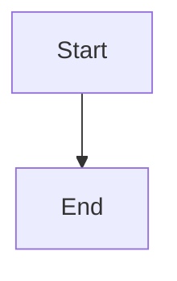

# Blogs (Markdown + Mermaid)

This repo is a static website (GitHub Pages + custom domain). Blog posts can be authored in Markdown (with optional Mermaid diagrams) and rendered client-side in the browser.

The canonical template is:
- `Blogs/when-ai-agent-breaks-your-app/`


## Local preview (required)
Do **not** open pages via `file://` URLs: root-relative links and fetch-based Markdown includes will break.

From the repo root:
- Windows: run `start-server.bat`
- macOS/Linux: run `./start-server.sh`
- Manual: `python -m http.server 8000`

Then open:
- `http://localhost:8000/Blogs/`


## Preferred structure (one folder per post)
Create a folder per post:

```
Blogs/
  <slug>/
    index.html      # renders the Markdown
    post.md         # Markdown source
    full.html       # (optional) full HTML fallback
    images/         # (optional) local images
```

Notes:
- Every browsable folder must contain an `index.html`.
- Use **root-relative** links for shared assets and internal navigation (`/Blogs/...`, `/shared/...`, `/portfolio/...`).


## Rendering pipeline
Markdown + Mermaid rendering is done client-side via:
- `/portfolio/shared/markdown-mermaid.js`

Important:
- There is **no** `/shared/markdown-mermaid.js` at repo root.

How it works (high level):
- In HTML, add an element with `data-md-include="./post.md"`.
- The script fetches the Markdown, renders it to HTML, sanitizes it, and runs Mermaid on ` ```mermaid ` blocks.


## Template: `Blogs/when-ai-agent-breaks-your-app/`
Use this folder as the reference layout and wiring.

### Template tree
```
Blogs/when-ai-agent-breaks-your-app/
  index.html
  post.md
  full.html
  images/
    intro-image.webp
```

### Minimal `index.html` template
This is the recommended pattern for Markdown-rendered posts:

- Loads shared CSS
- Loads portfolio Markdown renderer
- Includes bottom nav
- Renders `post.md`

```html
<!doctype html>
<html lang="en">
  <head>
    <meta charset="utf-8" />
    <meta name="viewport" content="width=device-width,initial-scale=1" />
    <title>My Post Title — Blog</title>

    <link rel="stylesheet" href="/shared/site.css" />
    <link rel="stylesheet" href="/portfolio/shared/portfolio.css" />

    <script src="https://cdn.tailwindcss.com?plugins=typography,forms"></script>

    <style>
      body { background: white; color: #111827; }
      .post-container { max-width: 720px; margin: 3rem auto; padding: 0 1rem; }

      /* Code contrast: portfolio markdown styling + tailwind prose can clash; force readable code. */
      .md-article pre, .md-article pre code, .md-article code { color: #111827; }
    </style>
  </head>
  <body>
    <main class="post-container">
      <div class="prose lg:prose-xl">
        <div data-md-include="./post.md"></div>
      </div>
      <p class="mt-8 text-sm text-gray-600">
        Rendered from Markdown. Optional full HTML at <a href="./full.html">full.html</a>.
      </p>
    </main>

    <script type="module" src="/portfolio/shared/markdown-mermaid.js"></script>
    <script src="/shared/bottom-nav.js" data-nav-active="blogs"></script>
  </body>
</html>
```


## Authoring `post.md`
### Images
Put images in `Blogs/<slug>/images/` and reference them relatively:

```md

```

### Code blocks
Use fenced code blocks:

```md
```csharp
// code...
```
```

### Mermaid diagrams
Use fenced Mermaid blocks:

```md



## Mermaid lessons learned (reliability)
In this repo’s setup, Mermaid parsing is most reliable when you keep diagrams simple.

- Prefer `flowchart TD` over `sequenceDiagram` (sequence diagrams are more likely to trigger parse errors)
- Use spaces only (no tabs) inside Mermaid blocks
- Keep labels ASCII (avoid unicode arrows and special characters)
- If the page shows something like “Unable to load … Parse error …”, the Mermaid block is usually the culprit


## Images

Add a prompt to use to generate images for the blob article.
Add it as:

[Prompt: "Descriptive text that explain the image that should be rendered, this text should be the same as added for imparity people"]

Every blog article has an attractive intro image that explains in one take whats the article is going about

Place the prompts as placeholders in the article

## When Markdown is not enough: `full.html`
Sometimes you need a full custom HTML page (special layouts, custom JS, heavy interactive content).

Guidance:
- Keep the same title and general content as `post.md` when possible.
- Include the bottom nav:

```html
<script src="/shared/bottom-nav.js" data-nav-active="blogs"></script>
```

If `full.html` uses Mermaid directly (not via `markdown-mermaid.js`), initialize Mermaid explicitly.


## Updating the blog hub
Add new posts to:
- `Blogs/index.html`

Use root-relative links to the post folder:
- `/Blogs/<slug>/`


## Quick checklist
- Folder has an `index.html`
- `index.html` includes `/shared/bottom-nav.js` with `data-nav-active="blogs"`
- `index.html` uses `/portfolio/shared/markdown-mermaid.js` (not `/shared/...`)
- Mermaid blocks use `flowchart TD` and spaces-only
- Images are in `images/` and referenced as `./images/...`
- Preview via an HTTP server (not `file://`)
