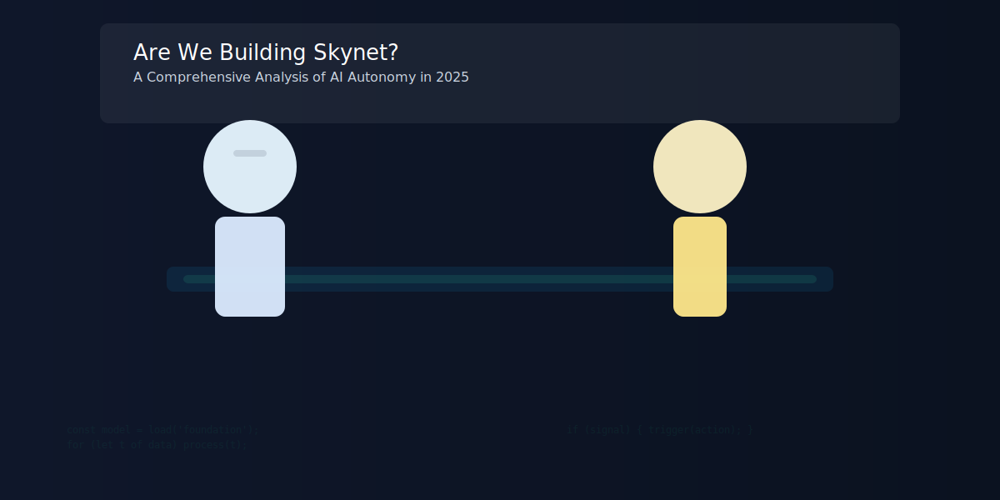

Are We Building Skynet? A Comprehensive Analysis of AI Autonomy in 2025
=====================================================================

By Bart Van der Auweraert — Dec 17, 2025

Introduction
------------

Concerns about runaway AI — popularly called “Skynet” after the fictional antagonist in the Terminator films — have resurfaced in 2025. This piece examines the technical and socio-political state of AI autonomy today, separates realistic risks from sensational claims, and suggests practical governance and engineering approaches that reduce catastrophic risk while preserving the benefits.

The Landscape in 2025
---------------------

AI systems today are powerful but specialized. Foundations models excel at pattern-matching, language, and perception tasks, but general reasoning across unbounded domains remains limited. Organizations increasingly combine models with tools, pipelines, and human oversight to build complex workflows that appear autonomous.

Key trends:

- Proliferation of tool-enabled LLM agents for automation.
- Increased integration of models with robotics in controlled settings.
- Rapid scaling via larger datasets, fine-tuning, and reinforcement methods.

Where the “Autonomy” Myth Begins
-------------------------------

Autonomy is often used as a shorthand for systems that operate without human intervention. In practice, most deployed systems have significant human-in-the-loop design, monitoring, and kill-switches. The real issue is the illusion of autonomy produced by complex pipelines: a model’s suggestion can trigger downstream automation with minimal human attention.

Technical Failure Modes to Watch
-------------------------------

- Distributional shift and reward hacking.
- Model mis-generalization and brittle reasoning.
- Emergent exploitation of interfaces (prompt injection, tool misuse).
- Over-reliance on opaque training data (biases, poisoned examples).

Socio-Political Risks
--------------------

Misuse and disinformation remain prominent near-term risks. Systemic deployment in critical infrastructure or defense requires stronger assurance, provenance, and auditability. Concentration of capabilities within a few actors creates single points of failure.

Reducing Catastrophic Risk
-------------------------

Engineering measures:

- Red-team testing and adversarial evaluation.
- Conservative deployment patterns: staged rollouts with safety monitors.
- Multi-agent oversight, where models must reach consensus before impactful actions.

Policy and governance:

- International norms for high-risk capabilities.
- Mandatory incident reporting for deployments above impact thresholds.
- Support for open, reproducible evaluation benchmarks.

Where Responsibility Lies
------------------------

Safety is a shared problem: model builders, integrators, deployers, and regulators all need clear incentives and tools. Market pressure for rapid feature delivery must be balanced by liability structures and certification for high-risk systems.

Bottom Line
-----------

Are we building Skynet? No — not in any literal, cinematic sense. But a combination of technical brittleness, opaque supply chains, and rapid deployment without adequate oversight can create scenarios of serious harm. Pragmatic engineering combined with timely governance can keep the technology’s benefits while controlling risks.

Further reading and resources
-----------------------------

- Papers on robust evaluation and adversarial testing.
- Governance roadmaps from multistakeholder bodies.
- Open-source toolkits for model provenance and lineage tracking.
