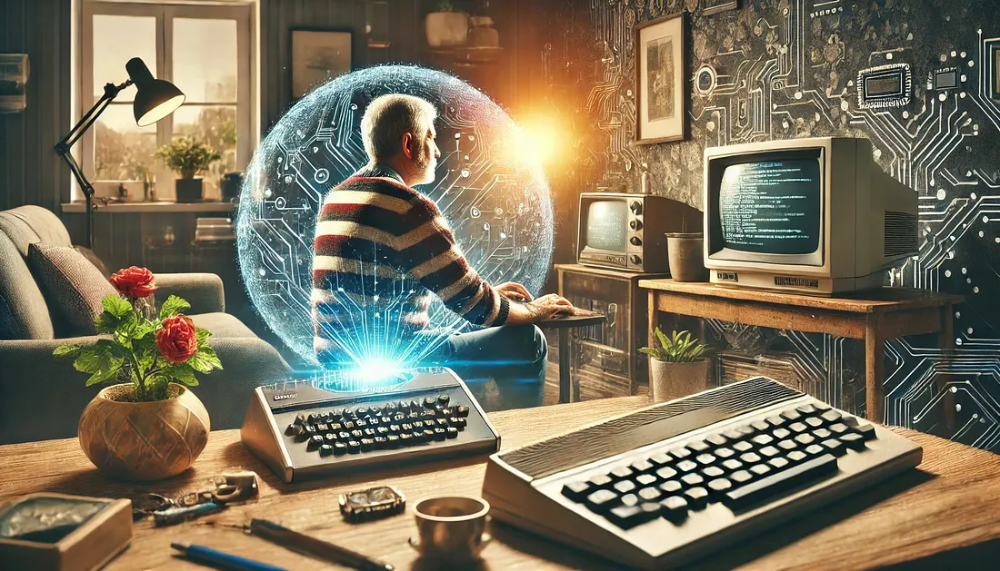

# From coder to creator: how AI inspires us to rethink our craft

*By Bart Van der Auweraert — Dec 11, 2024 — ~4 min read*

*[Click here to read it on Medium](https://medium.com/@bart.codeware/from-coder-to-creator-how-ai-inspires-us-to-rethink-our-craft-a4906496eb82)*

I remember the first time I touched a keyboard connected to my Sinclair ZX80 — my very first computer. It was a marvel of its time, without a hard disk, relying solely on a connection to the TV in my parents living room. If I accidentally unplugged it, all my carefully typed code would vanish, forcing me to start over. Of course, my parents liked to watch TV, which often meant my code was lost anyway — but I always found it funny to start over the next day. Looking back, I see that those early days taught me resilience, creativity, and the joy of discovery — lessons that have carried me through decades of rapid technological change.

Now, nearly forty years later, I stand at another transformative crossroads — one as monumental as those first steps into coding. The rise of artificial intelligence is reshaping not only how we build software but how we think about the very craft of creation itself. At first, I feared being left behind. But today, I see AI not as a replacement for human ingenuity, but as a co-pilot, enhancing our abilities and helping us rediscover the joy of problem-solving.

---

## Facing the tidal wave of rapid change

For much of my career, keeping up felt like the job: new frameworks, languages, deployment models and releases to master. Younger engineers often looked as if they were born with the latest stack already installed. At first I worried I might be left behind. Instead, I discovered a different possibility: AI as a co-pilot.

AI tools can generate snippets, explain patterns, and point out optimizations. Freed from repetitive tasks, we can focus on the problems that matter — the "why" behind the design — and on the creative choices that make software sing.

---

## AI as a co-pilot: from doubts to discovery

Rather than replacing experience, AI augments it. Decades of judgement and intuition pair well with an assistant that remembers API details and edge cases. The best outcomes come when we treat AI as a collaborator: guide it, review its output, and use it to extend our reach rather than outsource responsibility.

---

## Navigating change: developers at the helm

We are still the pilots. For now the human role is to interpret, curate, and direct — much like a conductor guiding an orchestra rather than playing every instrument. This shift applies beyond engineering: artists, teachers, and analysts can all find new workflows where AI expands their creative bandwidth.

---

## A glimpse into the future: where does the craft go?

If AI scaffolds entire applications and automates routine work, the role of the developer may evolve toward higher-level orchestration: designing intent, validating choices, and composing systems. But evolution doesn't mean extinction — it means a rebalancing of tasks toward creativity and stewardship.

---

## Rediscovering joy: coding as an art form

With repetitive work automated, many practitioners may rediscover coding as a personal craft. Freed from deadline-driven tedium, some will code for exploration and expression, using their knowledge to create work that is elegant, playful, or experimental.

---

## Evolving roles, enduring passions

I choose to embrace AI. I'll continue to use these tools to be more productive, to explore new territory, and to learn faster. And if the traditional job description shifts, I'll still write code — for the intellectual pleasure and for the act of creation itself.

---

## Concluding thoughts: adapt with grace and imagination

This isn’t a story about machines replacing humans. It’s about humans evolving with technology. Keep curiosity, keep craftsmanship, and treat AI as a creative partner that amplifies what you already do well.

---

### Acknowledgements

Thanks to Ann Van der Auweraert for her helpful feedback; to Erwin for his suggestions; and to Maarten for his contributions.

