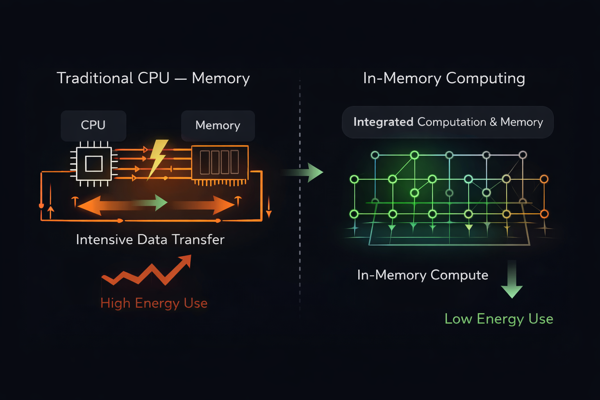
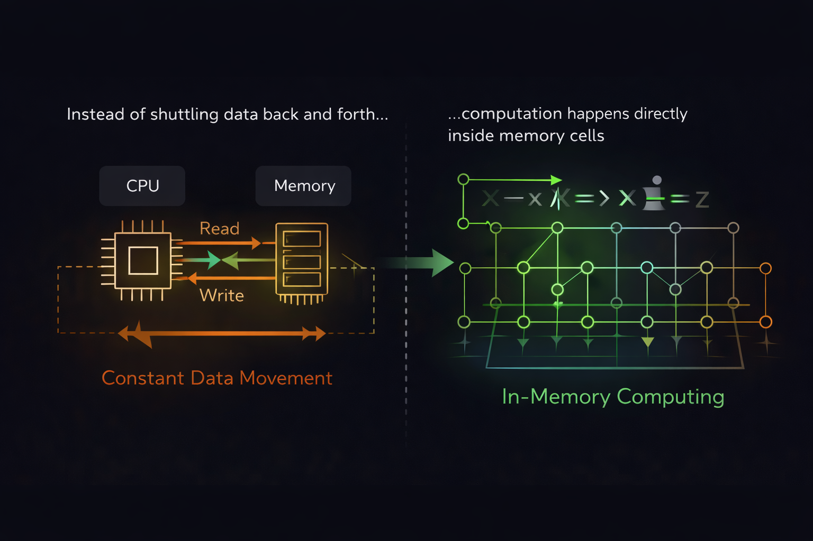
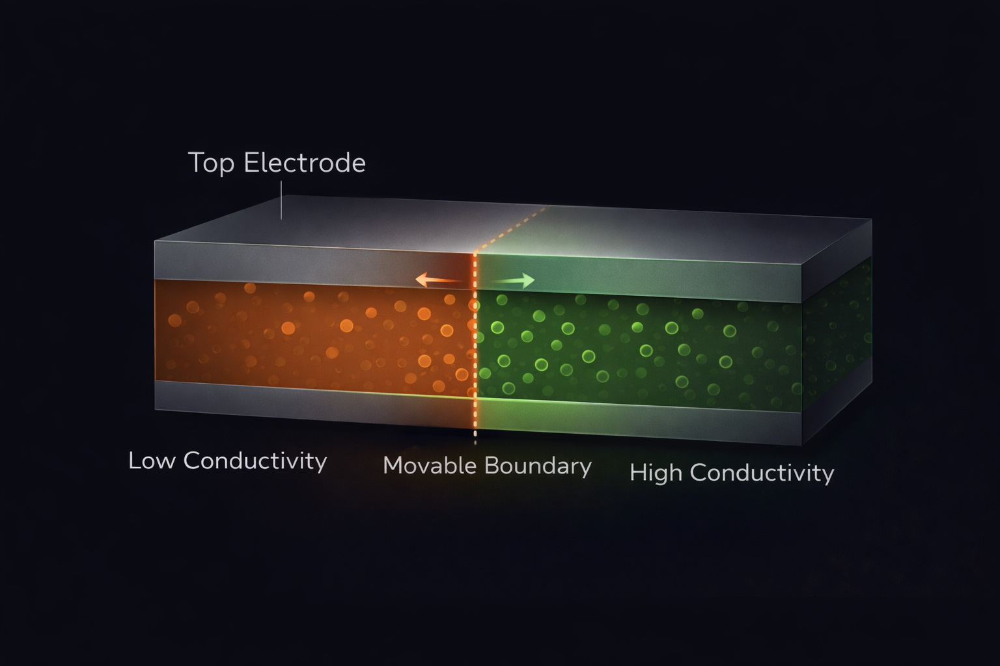
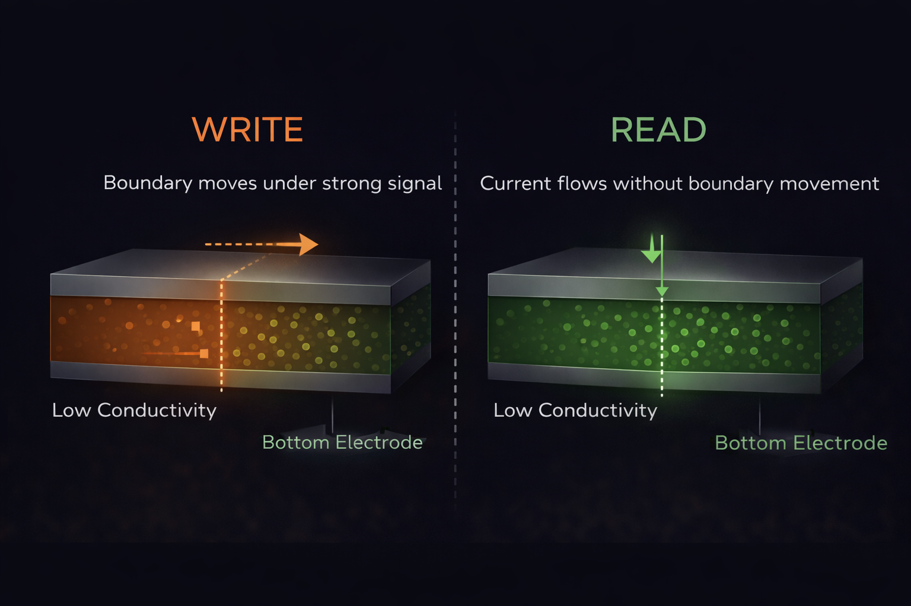
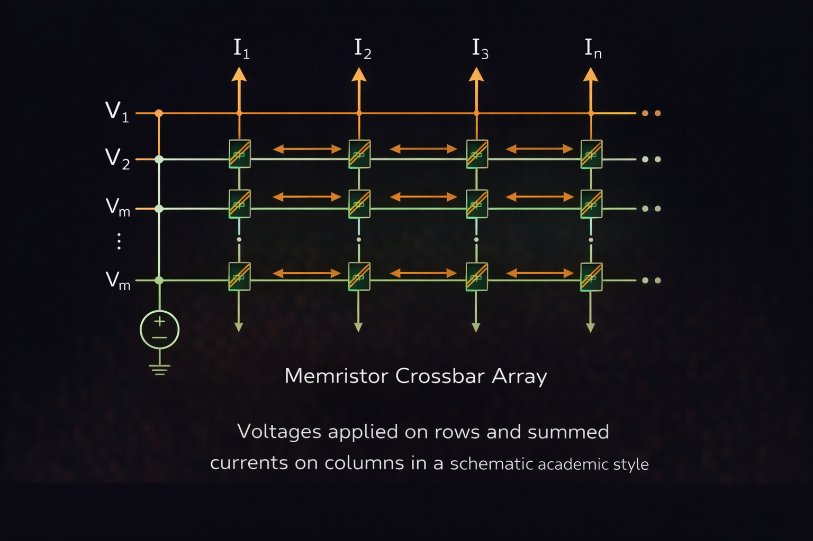
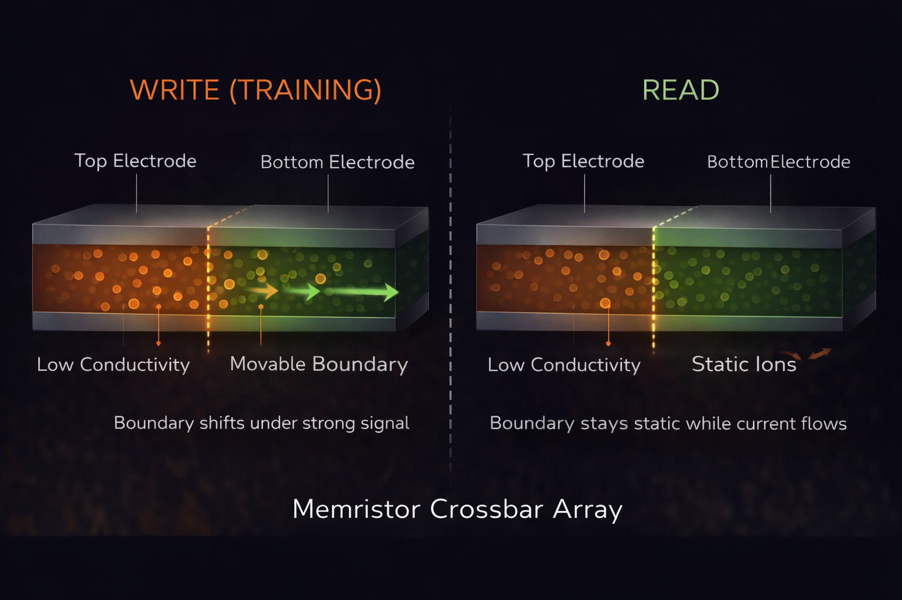

# Memristors Explained

*[Click here to read it on Medium](https://medium.com/@bart.codeware/memresistor-explained)*

*(why a new kind of computer memory could drastically reduce AI energy use)*

Artificial intelligence is becoming one of the **largest consumers of computing power** in the world. Training and running modern AI models already requires **massive amounts of electricity**, and this demand is growing rapidly.

Much of this energy is **not spent on “thinking”**, but on something surprisingly mundane:

> **Moving data back and forth between memory and processors.**

This problem is often called the **memory bottleneck**.

Traditional computers keep:

* **data** in memory
* **computation** in processors

Every operation requires shuttling numbers between the two — again and again, billions of times. For large AI models, this data movement dominates energy use.

Research repeatedly shows that **memory access costs far more energy than arithmetic itself**. As AI systems scale, this becomes a hard limit rather than a minor inefficiency.

note: you can see an interactive page with a training and interference simulation [here](/Blogs/memresistor-explained/memrestistor.html)

---

## What if memory could compute?

This is where **memristors** enter the picture.

A memristor is a type of memory element that can:

* **store a value**, and
* **participate directly in computation**

Instead of the traditional loop:

> read value → send to processor → compute → write back

memristor-based systems aim for:

> store the value and compute with it in place

This idea — often called **in-memory computing** — has the potential to reduce energy consumption by **one to two orders of magnitude** for specific AI operations, especially those dominated by repeated multiplications.

Exact numbers depend on technology and workload, but even partial improvements would have a major impact on AI sustainability.

---

## Why this matters now

Several trends are converging:

* AI workloads are growing exponentially
* Data centers already consume a significant share of global electricity
* Energy efficiency is becoming a **hard constraint**, not just a cost concern

Improving AI efficiency is no longer just about speed — it is about **scalability and sustainability**.

Memristors are not a magic solution, and they will not replace all existing hardware. But they represent a **fundamentally different way** of organizing memory and computation, which is why they deserve attention.

---

## The mental model: a physical slider

The most useful way to understand a memristor is to imagine a **slider**:

* **Left position** → current flows with difficulty → **high resistance**
* **Right position** → current flows easily → **low resistance**

The position of this slider *is the memory*.

The key idea is not the exact material details, but that the slider:

* can be **moved**
* can stop **anywhere between two extremes**
* **stays where it is**, even when power is removed

---

## What changes inside a memristor?

In many memristor implementations, the device behaves as if it contains:

* a region where current flows easily
* a region where current flows poorly
* a **boundary** between the two

Where that boundary sits determines the total resistance.

A sufficiently strong voltage causes **charged defects or ions** inside the material to drift slightly, shifting that boundary. A weak voltage does not.

You do not need to understand solid-state physics to follow the rest of this article. The only rule you need is:

> **Strong signal → internal state changes**
> **Weak signal → internal state is read, not changed**

---

## Writing vs reading: the crucial distinction

### Writing (also called training)

**Writing** means applying a signal strong enough to **change the internal state**.

* Each pulse moves the internal boundary a little
* Multiple pulses accumulate
* Resistance changes gradually
* The device “learns” a value

This is why we talk about *training* a memristor.

---

### Reading (also called inference)

**Reading** means applying a **small measurement voltage**.

* The internal state does not move
* You simply measure how much current flows
* That current reflects the stored resistance

This distinction — *write changes state, read does not* — is fundamental.

---

## Why memristors are not just 0 and 1

Traditional memory stores information digitally:

* 0 or 1
* off or on

A memristor, by contrast, can store a **continuous range of resistance values**.

That means it can represent values like:

* 0.12
* 0.47
* 0.91

This makes memristors suitable for representing **weights** — values that scale inputs rather than merely switch them on or off.

---

## Example 1: one memristor learning a multiplier

Consider the simple computation:

x · w = z

Where:

* **x** is the input
* **z** is the desired output
* **w** is the value stored in the memristor

### Training phase

During training:

1. Apply x
2. Measure the result x·w
3. Compare it to z
4. If the result is too small, push the memristor toward **lower resistance**
5. If the result is too large, push it toward **higher resistance**

Each training pulse slightly adjusts the internal state until:

x · w ≈ z

At that point, training stops.

---

### Inference phase

During inference:

* The memristor is no longer modified
* The stored resistance represents **w**
* Applying x automatically produces the correct output current

The multiplication happens because of **physics**, not because a processor executes instructions.

---

## Example 2: how many memristors do you need?

One memristor can store one analog value. But higher precision often requires multiple devices.

A simple explanation uses **bit slicing**:

* Use several memristors
* Each represents a binary weight (1, 2, 4, 8, …)
* Together they form a number

For example:

* 4 memristors → values from 0 to 15
* 8 memristors → values from 0 to 255

In this simplified view:

> **More precision means more memristors**

---

## Why this matters for AI

Many AI workloads are dominated by a single operation:

> **Matrix–vector multiplication**

With memristors arranged in **crossbar arrays**:

* Voltages represent inputs
* Conductance represents weights
* Currents naturally sum according to physical laws

This allows:

* Massive parallelism
* Very low energy use
* Computation inside memory itself

This approach is commonly referred to as **in-memory computing**.

---

## What the interactive animation shows

In the interactive demo accompanying this article:

* The bar represents the memristor
* The slider represents the internal state
* Orange dots represent ions or defects that remain after training
* Training pulses move them
* Read pulses do not

Visually:

* Training looks active and dynamic
* Reading looks calm and non-destructive

This mirrors the real physical distinction.

---

## In one sentence

A memristor is a resistor whose value can be trained by electrical signals, stored without power, and later used directly for computation.

---

## Glossary

| Term                         | Meaning                                            |
| ---------------------------- | -------------------------------------------------- |
| Resistance (R)               | How difficult it is for current to flow            |
| Conductance (G)              | Inverse of resistance; how easily current flows    |
| Training / Write             | Applying strong signals to change the stored state |
| Read / Inference             | Measuring current with a weak signal               |
| Weight                       | A stored value that scales an input                |
| Analog value                 | A value that varies continuously, not just 0 or 1  |
| Crossbar array               | Grid of memristors used for parallel computation   |
| In-memory computing          | Computing directly where data is stored            |
| Matrix–vector multiplication | Core operation in neural networks                  |

---

## Further reading

- **Leon Chua — *Memristor: The missing circuit element***  
  https://doi.org/10.1109/TCT.1971.1083337 

- **Memristive devices for computing** (review)  
  https://pubmed.ncbi.nlm.nih.gov/23269430/ 

- **Nature Electronics — The memristor revisited**  
  https://www.nature.com/articles/s41928-018-0083-3 

- **IBM Research — Analog AI and in-memory computing**  
  https://research.ibm.com/projects/analog-ai 

