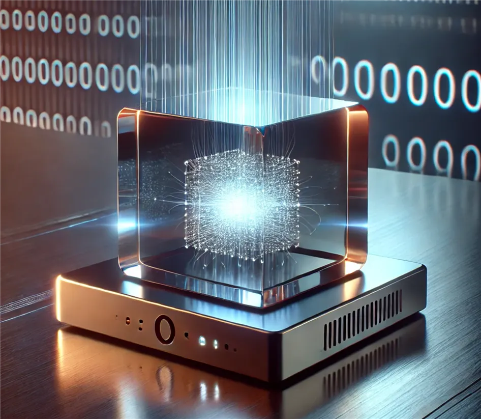
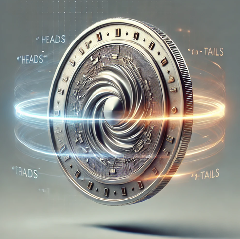
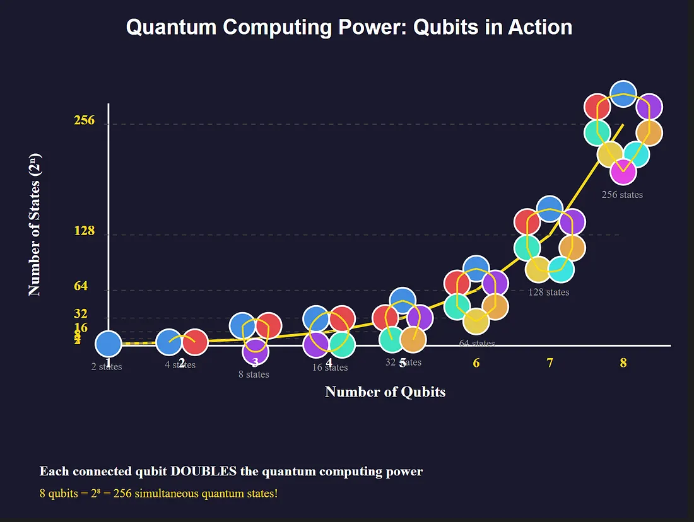

# Quantum Computers: Simply Explained (Even for You!)

By Bart Van der Auweraert — 4 min read — Jan 17, 2025

*[Click here to read it on Medium](https://medium.com/@bart.codeware/quantum-computers-simply-explained-even-for-you-528353ce4ae9)*

Quantum computers sound complicated, like something straight out of science fiction. But they're real, and they work very differently from the devices you use every day. The secret lies in **qubits**. These special building blocks do things regular bits cannot. What are qubits? How do they work? And why does it matter? Let's break it down in plain language.

## Bits vs. Qubits: What’s the Difference?

- **Bits** are like light switches: on (`1`) or off (`0`). Your laptop and phone use these.
- **Qubits** are more like a spinning coin: until you look, they're partly heads and partly tails. This property is called **superposition**.
- Imagine a board game with one token. A classical token can occupy only one square. A qubit can be in a blend of squares at once, giving it room to explore multiple options simultaneously.
- Only when you "catch" the spinning coin do you get a definite heads or tails. That ability to stay in mixed states is what makes qubits powerful.

## Superposition: How Does It Work?

Let's break superposition down step by step. Imagine you need to check four possible locations for a lost key.

- A regular computer inspects Spot 1, then Spot 2, then Spot 3, then Spot 4. Sequential and time-consuming.
- A quantum computer puts its qubits into superposition and can probe all four spots at the same time.
- Because of that, it does not need to try every option step by step; it can explore many at once.

More qubits = more power:

- 1 qubit can explore 2 possibilities at once.
- 2 qubits: 4 possibilities.
- 3 qubits: 8 possibilities.
- 10 qubits: 1,024 possibilities.
Quantum computers don’t need to try everything step by step. They can check numerous possibilities all at once.

## The Power of Many Qubits

Think of qubits like spinning coins that can land in combinations of heads and tails. With two coins you could see heads-heads, heads-tails, tails-heads, or tails-tails. Add a third coin and you double the combinations again. With every new qubit, the space of possibilities grows exponentially, which is why a handful of qubits can already tackle problems that stump classical machines.

For each new qubit you add, the number of possibilities doubles. This is what we mean by exponential growth:

- 1 qubit: 2 possibilities
- 2 qubits: 4 possibilities
- 3 qubits: 8 possibilities
- …
- 10 qubits: 1,024 possibilities
- …
- 50 qubits: over a quadrillion possibilities

## Quantum Entanglement: A Bit of Magic

Quantum computers have another special trick: **quantum entanglement**. Entanglement means that two qubits are mysteriously connected. When you observe one, you instantly know what the other is doing, even if they’re far apart.

Think of coins again. Imagine you have two coins that are invisibly linked. If you stop one coin and it lands on heads, you immediately know the other coin is also heads. Instantly — even if the other coin is on the other side of the world.

Note: this is a simplified way to understand it. The real science behind it is much more complex.

Entanglement allows qubits to work together extremely quickly. Regular bits can’t do this.

## Why Are Quantum Computers So Important?

Quantum computers aren’t for faster internet browsing. They excel at solving difficult problems — problems that regular computers take a long time to solve or can’t solve at all. For example:

- **Super-secure codes:** Quantum computers might crack today’s encryption, but they can also create new, ultra-secure codes.
- **New medicines:** They can accurately simulate how small particles (molecules) behave, helping in the discovery of new medicines.
- **Smarter routes:** Think of the best route for a truck or an airplane. Quantum computers can figure this out incredibly well.

Quantum computers can do things that classical computers simply cannot.

## Conclusion: The Future Is Quantum!

Quantum computers are still new, but they hold immense potential. With superposition and entanglement, they tackle problems we once thought impossible. They’re rewriting the rules of technology.

It might take a while before you have one at home. But who knows — in a few years, you might use a quantum computer for your everyday tasks. In the meantime, you can impress your friends with your knowledge about qubits.

It’s not just cool; it could change our future. The technology is still in its infancy, but progress is happening fast.

**Tags:** Quantum, Quantum Computing, Computer Science, AI Computing
