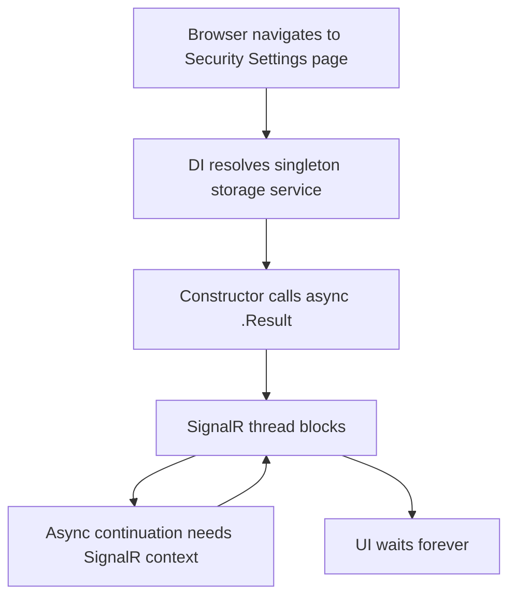

# Security Settings Page Hangs on Load

*A troubleshooting guide for the “infinite spinner” that isn’t a crash, isn’t a log, and isn’t obvious.*

---

## Problem description

The **Security Settings** page hangs indefinitely while loading (blank page or spinner). The application keeps running, other pages work, and you get **no useful errors**.

In the cases described here, the hang happens because the DI container tries to build a **singleton** service whose **constructor blocks on async work**.

---

## Symptoms

- The Security Settings page never finishes loading
- Browser shows an infinite spinner / blank page
- Other pages in the app work fine
- No meaningful errors in the browser console
- Server logs may show authentication/token attempts but no exception

---

## Root cause

`TableStorageService<T>` (or a similar service) is registered as a **Singleton**, and its constructor does blocking synchronous work:

- Calling async methods using `.Result` / `.Wait()`
- Doing I/O work in the constructor (creating clients, probing endpoints, creating tables, etc.)

That combination is dangerous in general, and in **Blazor Server** it can cause a **deadlock** because the request is running on a context-bound SignalR thread.

---

## Why the page blocks (the short version)

When you call `.Result` on an async operation:

1. The current thread blocks waiting for the task to complete
2. The async method’s continuation often tries to resume on the captured context
3. The context thread is blocked… so the continuation can’t run
4. You get a deadlock (or thread pool starvation under load)

---

## Deadlock walkthrough (single user, localhost)

This can happen even with just you on localhost.



---

## The problematic pattern

### Before (constructor blocks)

```csharp
public sealed class TableStorageService<T> where T : class
{
	private readonly TableClient _tableClient;

	public TableStorageService(string storageAccountName, string tableName)
	{
		// ❌ Blocking async in a constructor.
		var credential = TokenCredentialFactory.GetAsync().Result;

		var serviceClient = new TableServiceClient(
			new Uri($"https://{storageAccountName}.table.core.windows.net"),
			credential);

		_tableClient = serviceClient.GetTableClient(tableName);
		_tableClient.CreateIfNotExists(); // ❌ Also sync I/O
	}
}
```

What makes this extra painful:

- Constructors can’t be `async`
- DI *will* run constructors on the request/SignalR thread
- A singleton means “first request pays the price” — and it can lock up the UI

---

## The fix (lazy async initialization)

Make the constructor cheap (just store configuration). Do the heavy work lazily, using async, **exactly once**, guarded by a lock.

### After (constructor stores parameters; first use initializes async)

```csharp
public sealed class TableStorageService<T> where T : class
{
	private readonly string _storageAccountName;
	private readonly string _tableName;

	private TableClient? _tableClient;
	private bool _isInitialized;
	private readonly SemaphoreSlim _initLock = new(1, 1);

	public TableStorageService(string storageAccountName, string tableName)
	{
		_storageAccountName = storageAccountName;
		_tableName = tableName;
	}

	private async Task<TableClient> GetTableClientAsync()
	{
		if (_isInitialized && _tableClient is not null)
		{
			return _tableClient;
		}

		await _initLock.WaitAsync();
		try
		{
			if (_isInitialized && _tableClient is not null)
			{
				return _tableClient;
			}

			var credential = await TokenCredentialFactory.GetAsync();
			var serviceClient = new TableServiceClient(
				new Uri($"https://{_storageAccountName}.table.core.windows.net"),
				credential);

			_tableClient = serviceClient.GetTableClient(_tableName);
			await _tableClient.CreateIfNotExistsAsync();

			_isInitialized = true;
			return _tableClient;
		}
		finally
		{
			_initLock.Release();
		}
	}

	public async Task<T?> GetEntityAsync(string partitionKey, string rowKey)
	{
		var table = await GetTableClientAsync();
		// ...
		return default;
	}
}
```

---

## Why not “just use ConfigureAwait(false)”?

Sometimes you can dodge deadlocks by preventing continuations from resuming on the captured context.

But it’s not the real fix here:

- You often don’t control the internal awaits (SDK/3rd party code)
- It treats the symptom (deadlock) but not the design problem (blocking + heavy constructors)
- Under real load, blocking can still lead to thread pool starvation

The robust fix is: **don’t block in constructors; initialize async on first use**.

---

## Checklist for future you

- Avoid `.Result` / `.Wait()` in server code
- Never do network I/O in constructors used by DI
- Prefer scoped/transient services unless you truly need singleton
- If you need singleton: use lazy async init with a lock (`SemaphoreSlim`) and cache the result
- Log initialization start/finish so “infinite spinner” incidents become searchable

---

*Written as a customer-neutral troubleshooting guide. Names/identifiers in code are placeholders.*
