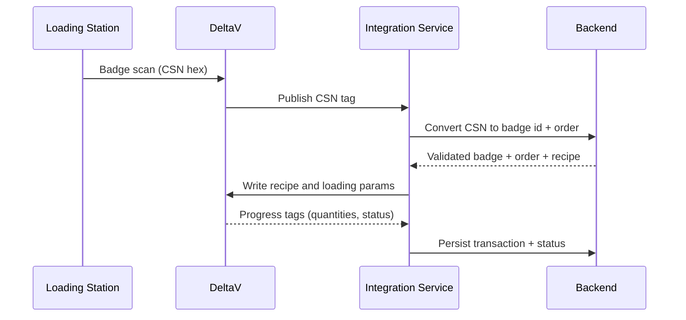
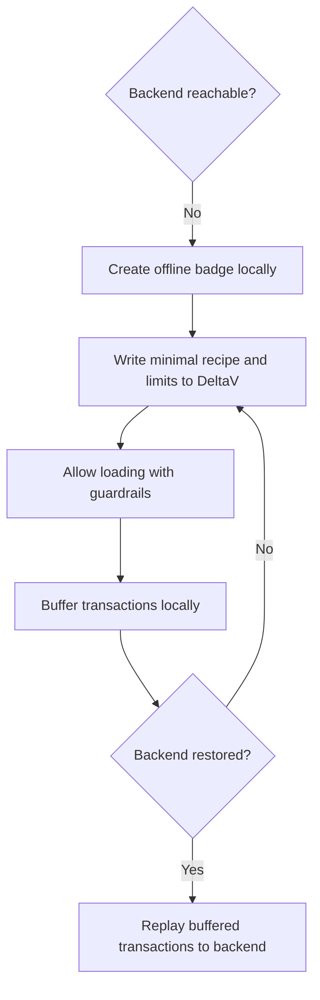
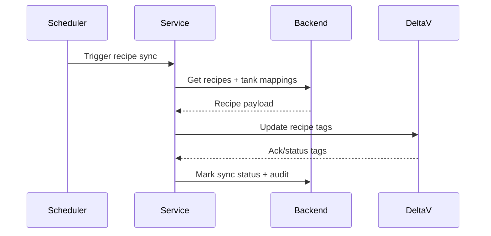

# Badge authentication and loading workflows

## Badge-to-loading sequence

```mermaid
sequenceDiagram
  participant Station as Loading Station
  participant DeltaV
  participant Service as Integration Service
  participant Backend

  Station->>DeltaV: Badge scan (CSN hex)
  DeltaV->>Service: Publish CSN tag
  Service->>Backend: Convert CSN to badge id + order
  Backend-->>Service: Validated badge + order + recipe
  Service->>DeltaV: Write recipe and loading params
  DeltaV-->>Service: Progress tags (quantities, status)
  Service->>Backend: Persist transaction + status
```

## Offline badge fallback

```mermaid
flowchart TD
  A{Backend reachable?}
  A -->|No| B[Create offline badge locally]
  B --> C[Write minimal recipe and limits to DeltaV]
  C --> D[Allow loading with guardrails]
  D --> E[Buffer transactions locally]
  E --> F{Backend restored?}
  F -->|Yes| G[Replay buffered transactions to backend]
  F -->|No| C
```

## Recipe synchronization loop

```mermaid
sequenceDiagram
  participant Scheduler
  participant Service
  participant Backend
  participant DeltaV

  Scheduler->>Service: Trigger recipe sync
  Service->>Backend: Get recipes + tank mappings
  Backend-->>Service: Recipe payload
  Service->>DeltaV: Update recipe tags
  DeltaV-->>Service: Ack/status tags
  Service->>Backend: Mark sync status + audit
```
